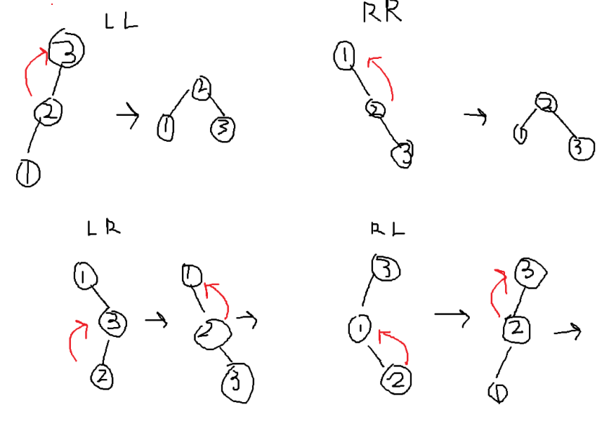

# AVL Tree

### Terminologies

##### Balanced Binary Search Tree
- If insertion is bad (E.g. [1,2,3,4,5]), nodes will go into one side, tree is not balanaced
- A tree is balanced if at each node the height of the left and right subtree is differ by atmost one 

---

### Properties 
- binary search tree with balanced condition 
- a rotation is needed only when a new node is inserted into an AVL Tree
- just think as 3 node rotate until become a triangle shape
- RL: Right-Left Double Rotation, a new node is inserted into the left subtree of right child
  


--- 

### Implementations explanation 
```c
AVLTreeADT LeftRotate(AVLTreeADT t){
    return NonemptyAVLTree(
        AVLRoot(RightAVLSubtree(t)), // right child become new root 
        NonemptyAVLTree(
            AVLRoot(t), // original root go down 
            LeftAVLSubtree(t), // original left subtree 
            LeftAVLSubtree(RightAVLSubtree(t)) // right child's left subtree 
        ),
        RightAVLSubtree(RightAVLSubtree(t)) // take right child's right subtree 
    );
}
```

```c
AVLTreeADT RightRotate(AVLTreeADT t) {
    return NonemptyAVLTree(
        AVLRoot(LeftAVLSubtree(t)), // left child become new root 
        LeftAVLSubtree(LeftAVLSubtree(t)), // take left child's left subtree 
        NonemptyAVLTree(
            AVLRoot(t), // original root go down 
            RightAVLSubtree(LeftAVLSubtree(t)), // left child's right subtree 
            RightAVLSubtree(t) // original right subtree 
        )
    );
}
```

```c
AVLTreeADT AVLInsertNode(TreeNodeADT X, AVLTreeADT T) {
    if (AVLTreeIsEmpty(T))return NonemptyAVLTree(X, EmptyAVLTree(), EmptyAVLTree());
    int sign = strcmp(GetNodeKey(X), GetNodeKey(AVLRoot(T)));

    // put on left-subtree
    if (sign < 0) { 
        // form a new tree (updated left-subtree + root + right-subtree)
        AVLTreeADT NewTree = NonemptyAVLTree(AVLRoot(T), AVLInsertNode(X, LeftAVLSubtree(T)), RightAVLSubtree(T));   
        // unbalanced condition (left-subtree too long)
        // compare inserted node with left child to decide it is R or LR
        if (AVLTreeHeight(LeftAVLSubtree(NewTree)) - AVLTreeHeight(RightAVLSubtree(NewTree)) == 2)
            return (strcmp(GetNodeKey(X),
                           GetNodeKey(AVLRoot(LeftAVLSubtree(NewTree)))) < 0 ?
                        RightRotate(NewTree) :
                        LeftRightRotate(NewTree)); 
        return NewTree;
    }

    // put on right-subtree
    if (sign > 0) { 
        // form a new tree (left-subtree + root + updated right-subtree)
        AVLTreeADT NewTree = NonemptyAVLTree(AVLRoot(T), LeftAVLSubtree(T), AVLInsertNode(X, RightAVLSubtree(T)));
        // unbalanced condition (right-subtree too long)
        if (AVLTreeHeight(RightAVLSubtree(NewTree)) - AVLTreeHeight(LeftAVLSubtree(NewTree)) == 2)
            return (strcmp(GetNodeKey(X),
                           GetNodeKey(AVLRoot(RightAVLSubtree(NewTree)))) > 0 ?
                        LeftRotate(NewTree) :
                        RightLeftRotate(NewTree));
        return NewTree;
    }
    return NonemptyAVLTree(X, LeftAVLSubtree(T), RightAVLSubtree(T));
}
```

--- 

### Exam questions 
- basically all questions is dry rynning
- so should be quite familar after hw/ quiz

---

### Implementaions 
[link](../../../ADTImplementation/AVLTree/)
