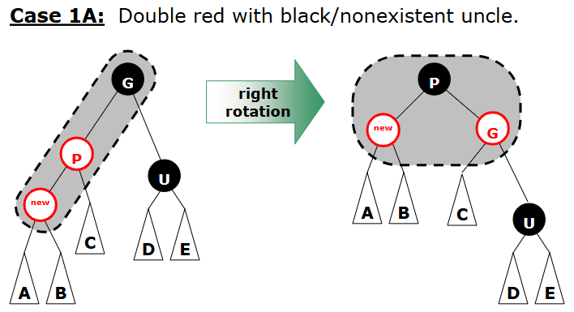
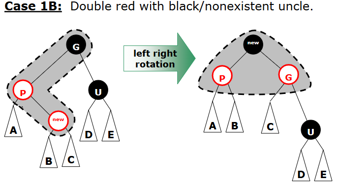
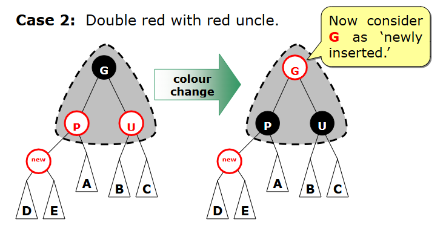
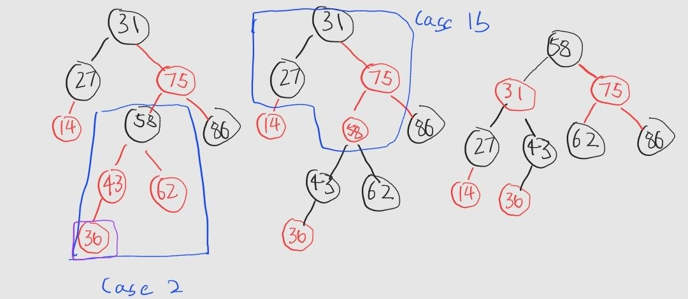

# Priority queue 

### Properties 
- binary search tree
- node is colored as black or red
- root is black
- parent of every red node is black
- every path from any node to a leaf node(in their subtree) must contain same number of black nodes
    - longest path from root to leaf never longer than twice of shortest path (shortest path: all black, longest path: rbrbrb...)

- newly inserted node is always red
    - become black if tree is empty
- rotate when parent is red 

##### Case 1: Double red with black/nonexistent uncle
- similar to avl tree, we need to let 3 node form a triangle

  

##### Case 2: Double red with red uncle
- only need change color
- consider G as newly inserted (only case root change to red)
  

---

### Exam questions 
- similar to avl tree, mainly dry run

1. The following 4 keys are inserted into the red-black tree above in the order as shown: 36, 40, 71, 50. Show what the red black tree looks like after each of these keys is inserted. (22 Q6)
  

---

### Implementaions 
- not exists
